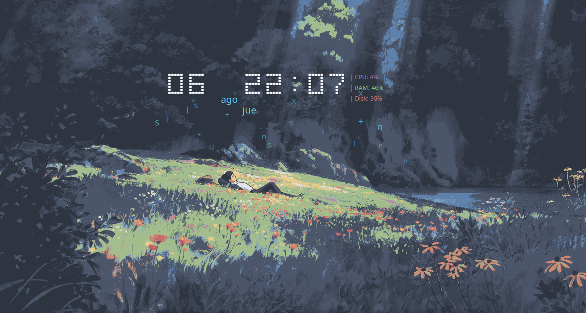

# Conky Theme - Studio Ghibli 🍃

Un tema minimalista y elegante para Conky en entornos Linux (optimizado para Linux Mint XFCE). Muestra un reloj, fecha, lluvia de caracteres animados y estadísticas del sistema (CPU, RAM y Disco) utilizando scripts de Lua.



## Archivos del repositorio

- `conky.conf`: Archivo principal de configuración.
- `lluvia.lua`: Script encargado de los gráficos, animaciones y lectura de estadísticas.
- `1.png`: Fondo de pantalla estilo Studio Ghibli.
- `setup.sh`: Script de instalación automática.

## Instalación automática

La forma más rápida de aplicar este tema en cualquier computadora con una distribución basada en Debian/Ubuntu es usando el script de instalación incluido.

1. Clona este repositorio:
   ```bash
   git clone [https://github.com/JounBrown/ghibli_desktop.git](https://github.com/JounBrown/ghibli_desktop.git)

2. Entra a la carpeta del proyecto:
    cd ghibli_desktop

3. Otorgar permisos de ejecución:
    chmod +x setup.sh

4. Ejecuta el instalador
    ./setup.sh

